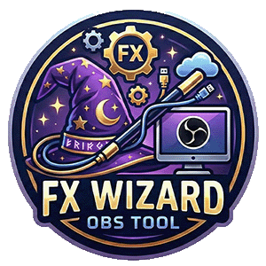
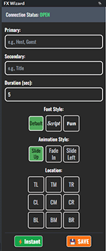
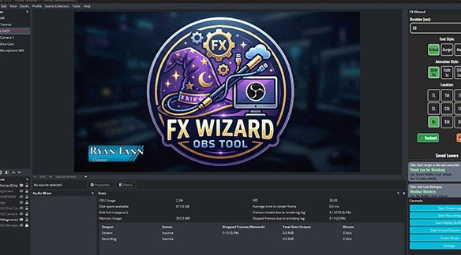

# FX Wizard: WebSocket Lower Third Overlay





FX Wizard is a simple, customizable system for controlling animated lower-third graphics on an OBS stream (or any browser source) using a separate web controller interface. It leverages WebSockets for instant, real-time communication between the controller and the display.

## Table of Contents
- [✨ Features](#features)
- [🛠️ Setup](#setup)
  - [Prerequisites](#prerequisites)
  - [Installation Steps](#installation-steps)
- [🖥️ Usage](#usage)
    - [Controller View (Input)](#controller-view-input)
    - [Display View (OBS Source)](#display-view-obs-source)
- [📜 License](#license)
- [📧 Contact](#contact)
- [📷 Screenshots](#screenshots)
- [🔗 Links](#links)

## Features

- **WebSocket Communication**: Uses WebSockets for real-time updates between the controller and the display.
- **Real-time Control**: Instantly send text and positioning data to the OBS overlay via WebSockets.

- **Two-View System**: Separates the Controller (input/management) and the Display (OBS source).

- **Customizable Location**: Supports a 3x3 grid for precise placement of the graphic (Top/Center/Bottom, Left/Middle/Right).

- **Variable Duration**: Users can specify the exact time (in seconds) the lower third stays on screen before automatically fading out.

- **Preset Storage**: Save frequently used lower-third combinations (Name, Title, Location, Font, and Duration) using Local Storage for quick recall.
- **Customizable Fonts**: Includes options for default, script, and fun font styles.

<a id="setup"></a>

## Setup

### Prerequisites

- **ws Library**: The Node.js WebSocket library.

### Installation Steps

- **Install Dependencies**: Open your terminal in the project directory and run:

```Bash
npm install ws
``` 
- **Clone the Repository**: If you haven't already, clone the repository to your local machine

Start the Server: Run the Node.js server using:

```Bash

node server.js
```

(Alternatively, use the included launch_server.bat file to run the server in the background, if configured correctly). You should see the message: WebSocket Server started on ws://localhost:8080..

<div id="usage"></div>

## Usage

The system is accessed via the websocket_demo.html file, using URL hashes to select the mode. The WebSocket server must be running before accessing either page.

<div id="controller-view-input"></div>

### 1. Controller View (Input)

This is the interface you use to manage and send graphics.

#### ***Functionality***

Primary/Secondary: Input the main name/label and the smaller title/subtitle.

Duration (sec): Set how long the graphic should remain visible (default is 5 seconds).

Location/Font: Select the desired position and style.

⚡ Instant Send: Sends the current form contents immediately.

💾 Save Lower 3rd: Saves the current form contents as a reusable button in the "Saved Lowers" section below.

---

### 2. Display View (OBS Source)

This view is added to OBS as a Browser Source.
This is the view that shows the animated lower third graphic.

***Access:*** Open websocket_demo.html#display.

#### ***OBS Setup***

In OBS, add a new Browser Source.

Set the Local File checkbox.

Browse and select websocket_demo.html.

In the URL field, add the hash: file:///[path-to-file]/websocket_demo.html#display

Set your desired OBS source size (e.g., 1920x1080).

Check "Shutdown source when not active" and "Refresh browser when scene becomes active" for best performance.

Crucially, ensure the CSS property for the OBS source is transparent so only the lower third appears.

When you click a button in the Controller View, the graphic will appear in the Display View (and your OBS scene) with a smooth animation and fade out after the set duration.

<div id="license"></div>

## License

This project is licensed under the MIT License - see the [LICENSE](.) file for details.

<div id="contact"></div>

## Contact

For questions or support, please contact the author at: [Gmail](mailto:ryan.fann@gmail.com) or visit the GitHub repository: [obsWebsocket](https://github.com/8bitginger/obsWebsocket)

<div id="screenshots"></div>

## Screenshots


*Controller View (Input)*


*Display View (OBS Source)*

<div id="links"></div>

## Links

- [GitHub Repository](https://github.com/8bitginger/obsWebsocket)
- [MIT License](LICENSE)
- [Node.js ws Library](https://www.npmjs.com/package/ws)
- [OBS Studio](https://obsproject.com/)
